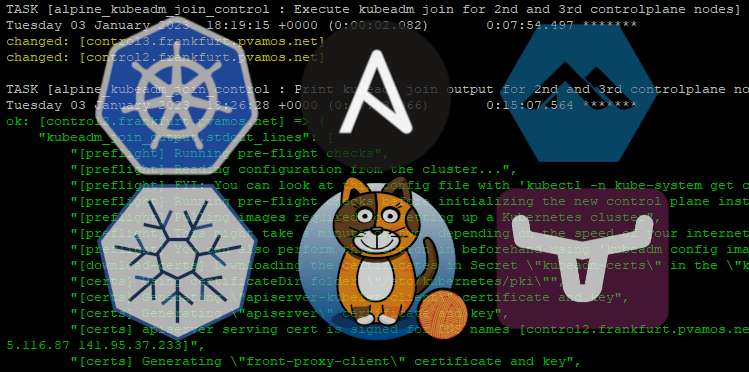

# alpine-k8s

<https://github.com/pvamos/alpine-k8s>


## Install IPv4/IPv6 dual-stack HA Kubernetes 1.25 cluster with Calico network and Longhorn storage, on Alpine linux 3.17, automated with Ansible and Kubeadm

***A simple "run only one playbook" solution deploying Highly Available IPv4/IPv6 dual-stack Kubernetes cluster on Alpine Linux, with Calico network and Longhorn storage, in a fully automated way using Ansible. The cluster has 3 controlplane nodes and any number of worker nodes.***



## Software versions used:
- Alpine Linux v3.17
  - Alpine Linux is a Linux distribution designed to be small, simple and secure. Alpine Linux uses musl C standard library, BusyBox and OpenRC instead of the more commonly used glibc, GNU Core Utilities and systemd respectively. For security, Alpine compiles all user-space binaries as position-independent executables with stack-smashing protection. <https://www.alpinelinux.org>
    - musl C standard library 1.2.3-r4 <https://musl.libc.org>
    - BusyBox 1.35.0-r29 <https://busybox.net>
    - OpenRC init system 0.45.2-r7 <https://github.com/OpenRC/openrc>
- Linux kernel 6.1.2-0-virt
- CRI-O 1.24.1-r6
  - CRI-O is an OCI-based implementation of the Kubernetes Container Runtime Interface. <https://cri-o.io>
- Kubernetes 1.25.0-r4 
  - Kubernetes, also known as K8s, is an open-source system for automating deployment, scaling, and management of containerized applications. <https://kubernetes.io>
- Calico v3.25.0
  - Calico is an open source networking and network security solution for containers, virtual machines, and native host-based workloads. Calico supports a broad range of platforms including Kubernetes. Calico’s rich network policy model makes it easy to lock down communication so the only traffic that flows is the traffic you want to flow. <https://projectcalico.docs.tigera.io/about/about-calico>
- HAProxy 2.6.7-r0
  - HAProxy is a free and open source software that provides a high availability load balancer and reverse proxy for TCP and HTTP-based applications that spreads requests across multiple servers. It is written in C and has a reputation for being fast and efficient. <https://www.haproxy.org>
- Keepalived 2.2.7-r2
  - Keepalived is a routing software written in C. The main goal of this project is to provide simple and robust facilities for loadbalancing and high-availability to Linux system and Linux based infrastructures. <https://www.keepalived.org>
- Longhorn v1.4.0
  - Longhorn is a distributed block storage system for Kubernetes. Longhorn is lightweight, reliable, and powerful. Once Longhorn is installed, it adds persistent volume support to the Kubernetes cluster. <https://longhorn.io>

### What is included:
- Ansible roles, templates etc. and playbook to configure Alpine Linux and install Kubernetes, Calico networking and Longhorn storage.
- Full output of a successful deployment run in `lastrun.log` at <https://github.com/pvamos/alpine-k8s/blob/main/lastrun.log>

## Requirements

- External load balancer for the HA Kubernetes API, accessible from all nodes, and capable to access controlplane nodes
  - I use 2 small <https://ovh.com> VPS-es as a HA Active/Standby HAProxy setup, sharing a floating IP with Keepalived *(1 vCore, 2 GB memory, 20 GB ssd)* storage
- 3 controlplane nodes
  - x86_64, minimum 2GB RAM, 8GB storage, 2 CPU cores *(ideally more)*
  - I use <https://ovh.com> VPS-es with:
    -  1 vCore *(using '--ignore-preflight-errors=NumCPU')*
    -  2 GB memory
    -  40 GB SSD storage
- Any (1+) number of worker nodes *(I use 3 workers)*
  - x86_64, minimum 4GB RAM, 20GB storage, 2 CPU cores *(ideally much more)*
  - I use <https://ovh.com> VPS-es with:
    -  2 vCores
    -  4 GB memory
    -  80 GB SSD storage
- IPv4 and IPv6 networking for the nodes, with internet access
- DNS resolution of all node FQDN-s on all nodes
- Public internet connection on the nodes to access repos and packages
- SSH access of the nodes from the ansible host with key based authentication
- An ansible host with a fairly recent version of ansible. Tested with Ansible core 2.14.1 and Python 3.11.0.

## Preparing the nodes

### Node starting state

All nodes have:
- Alpine Linux v3.17 installed
- IPv4 and IPv6 configured
- Key based passwordless ssh configured for a user, the keys are also present on the ansible host.

Worker nodes have:
- Plenty of space avaiable at `/var/lib/longhorn` to store Longhorn Persistent Volumes
  - I use a separate xfs volume mounted as `/var/lib/longhorn` on workers.

### Actualize the node related configuration at `group_vars/all`

The global configuration parameters are set at `group_vars/all`.

#### Set the user having access to the nodes. I use a non-standard ssh port, you can also use `ansible_port: 22`.

```yaml
...
ansible_port: 31212
ansible_user: p
ansible_ssh_private_key_file: ~/.ssh/id_ed25519
ansible_user_publickey: ~/.ssh/id_ed25519.pub
...
```

#### Set the loadbalancer

I use 2 small VPS-es as a HA Active/Standby HAProxy setup in front of the 3 Kubernetes API servers running on the 3 controlplane nodes. The 2 HAProxy hosts share a floating IP with Keepalived.

```yaml
...
loadbalancer_ipv4: 141.95.37.233
...
```

Both HAProxy hosts are configured the similarly, forwarding requests to the API servers on the 3 controlplane nodes:

```
defaults
    maxconn 20000
    mode    tcp
    option  dontlognull
    timeout http-request 10s
    timeout queue        1m
    timeout connect      10s
    timeout client       86400s
    timeout server       86400s
    timeout tunnel       86400s

frontend k8s-api
    bind 141.95.37.233:6443
    mode tcp
    default_backend k8s-api

backend k8s-api
    balance roundrobin
    mode tcp
    option tcp-check
    default-server inter 10s downinter 5s rise 2 fall 2 slowstart 60s maxconn 250 maxqueue 256 weight 100
    server control1 51.195.116.80:6443 check
    server control2 51.195.116.87:6443 check
    server control3 51.195.117.170:6443 check

```


#### Set IP addresses and network parameters for the nodes

All nodes have a similar block in `group_vars/all`.

```yaml
...
c1_fqdn: control1.frankfurt.pvamos.net
c1_hostname: control1
c1_domain: frankfurt.pvamos.net
c1_ipv4addr: 51.195.116.80
c1_ipv6addr: 2001:41d0:701:1100::5901
c1_ipv6mask: /128
c1_ipv6_defaultgw: 2001:41d0:701:1100::1
c1_city: Frankfurt
...
```


## Run the main ansible playbook `alpine-k8s.yaml`

#### This ansible playbook deploys and configures:

- CRI-O
- Kubelet
- HA Kubernetes Controlplane
- Multiple Kubernetes Worker nodes
- IPv4/IPv6 dual-stack Calico VXLAN networking, with full Network Policy capabilities
- Longhorn Cloud native distributed block storage for Kubernetes

You can simply run it by:

```sh
time ansible-playbook -i hosts alpine-k8s.yaml
```

The `alpine-k8s.yaml` playbook applies the below roles to the cluster nodes:

```yaml
---

- name: Alpine linux cri-o install
  hosts: workers:controlplane
  gather_facts: true
  roles:
    - role: alpine_apkrepo
    - role: alpine_kernelparams
    - role: alpine_crio

- name: Alpine linux install kubelet
  hosts: workers:controlplane
  gather_facts: true
  roles:
    - role: alpine_kubelet

- name: Alpine linux kubeadm init
  hosts: control1
  gather_facts: true
  roles:
    - role: alpine_kubeadm_init

- name: Alpine linux kubeadm join controlplane
  hosts: control23
  gather_facts: true
  roles:
    - role: alpine_kubeadm_join_control

- name: Alpine linux kubeadm join workers
  hosts: workers
  gather_facts: true
  roles:
    - role: alpine_kubeadm_join_workers

- name: Alpine linux after kubeadm join
  hosts: workers:controlplane
  gather_facts: true
  roles:
    - role: alpine_kubeadm_afterjoin
    - role: alpine_calico
    - role: alpine_longhorn
```

Full output of a successful deployment run is available in `lastrun.log` at <https://github.com/pvamos/alpine-k8s/blob/main/lastrun.log>

## Start using your cluster

### Connect to the Kubernetes cluster

Use the kube config placed at `~/.kube/config` on ansible node, also present at `/etc/kubernetes/admin.conf` on the controlplane node.

```
[p@ansible alpine-k8s]$ kubectl get nodes -owide
NAME                            STATUS   ROLES           AGE     VERSION   INTERNAL-IP      EXTERNAL-IP   OS-IMAGE             KERNEL-VERSION   CONTAINER-RUNTIME
control1.frankfurt.pvamos.net   Ready    control-plane   17m     v1.25.0   51.195.116.80    <none>        Alpine Linux v3.17   6.1.2-0-virt     cri-o://1.24.1
control2.frankfurt.pvamos.net   Ready    control-plane   9m44s   v1.25.0   51.195.116.87    <none>        Alpine Linux v3.17   6.1.2-0-virt     cri-o://1.24.1
control3.frankfurt.pvamos.net   Ready    control-plane   15m     v1.25.0   51.195.117.170   <none>        Alpine Linux v3.17   6.1.2-0-virt     cri-o://1.24.1
worker1.frankfurt.pvamos.net    Ready    <none>          9m13s   v1.25.0   51.195.116.254   <none>        Alpine Linux v3.17   6.1.2-0-virt     cri-o://1.24.1
worker2.frankfurt.pvamos.net    Ready    <none>          9m16s   v1.25.0   51.195.118.45    <none>        Alpine Linux v3.17   6.1.2-0-virt     cri-o://1.24.1
worker3.frankfurt.pvamos.net    Ready    <none>          9m16s   v1.25.0   51.195.119.241   <none>        Alpine Linux v3.17   6.1.2-0-virt     cri-o://1.24.1
[p@ansible alpine-k8s]$ 
[p@ansible alpine-k8s]$ 
[p@ansible alpine-k8s]$ kubectl get node control1.frankfurt.pvamos.net -o go-template --template='{{range .status.addresses}}{{printf "%s: %s\n" .type .address}}{{end}}'
InternalIP: 51.195.116.80
InternalIP: 2001:41d0:701:1100::5901
Hostname: control1.frankfurt.pvamos.net
[p@ansible alpine-k8s]$ 
[p@ansible alpine-k8s]$ 
[p@ansible alpine-k8s]$ kubectl get node worker1.frankfurt.pvamos.net -o go-template --template='{{range .status.addresses}}{{printf "%s: %s\n" .type .address}}{{end}}'
InternalIP: 51.195.116.254
InternalIP: 2001:41d0:701:1100::5fa8
Hostname: worker1.frankfurt.pvamos.net
[p@ansible alpine-k8s]$ 
[p@ansible alpine-k8s]$ 
[p@ansible alpine-k8s]$ kubectl get pods -A -owide
NAMESPACE         NAME                                                    READY   STATUS    RESTARTS        AGE     IP               NODE                            NOMINATED NODE   READINESS GATES
calico-system     calico-node-7h7ck                                       1/1     Running   1 (6m30s ago)   8m13s   51.195.116.87    control2.frankfurt.pvamos.net   <none>           <none>
calico-system     calico-node-bnw8q                                       1/1     Running   0               8m13s   51.195.116.254   worker1.frankfurt.pvamos.net    <none>           <none>
calico-system     calico-node-ck4kl                                       1/1     Running   0               8m13s   51.195.117.170   control3.frankfurt.pvamos.net   <none>           <none>
calico-system     calico-node-hhz54                                       1/1     Running   0               8m13s   51.195.119.241   worker3.frankfurt.pvamos.net    <none>           <none>
calico-system     calico-node-lhwxx                                       1/1     Running   0               8m13s   51.195.116.80    control1.frankfurt.pvamos.net   <none>           <none>
calico-system     calico-node-z9zlx                                       1/1     Running   0               8m13s   51.195.118.45    worker2.frankfurt.pvamos.net    <none>           <none>
calico-system     calico-typha-57444d8bb7-b22c7                           1/1     Running   0               8m7s    51.195.119.241   worker3.frankfurt.pvamos.net    <none>           <none>
calico-system     calico-typha-57444d8bb7-bsqbs                           1/1     Running   0               8m7s    51.195.118.45    worker2.frankfurt.pvamos.net    <none>           <none>
calico-system     calico-typha-57444d8bb7-n6vzv                           1/1     Running   0               8m13s   51.195.116.254   worker1.frankfurt.pvamos.net    <none>           <none>
kube-system       coredns-565d847f94-q5pr6                                1/1     Running   0               16m     10.244.23.65     control3.frankfurt.pvamos.net   <none>           <none>
kube-system       coredns-565d847f94-rhmbv                                1/1     Running   0               16m     10.244.23.66     control3.frankfurt.pvamos.net   <none>           <none>
kube-system       etcd-control1.frankfurt.pvamos.net                      1/1     Running   0               16m     51.195.116.80    control1.frankfurt.pvamos.net   <none>           <none>
kube-system       etcd-control2.frankfurt.pvamos.net                      1/1     Running   0               9m26s   51.195.116.87    control2.frankfurt.pvamos.net   <none>           <none>
kube-system       etcd-control3.frankfurt.pvamos.net                      1/1     Running   0               15m     51.195.117.170   control3.frankfurt.pvamos.net   <none>           <none>
kube-system       kube-apiserver-control1.frankfurt.pvamos.net            1/1     Running   0               17m     51.195.116.80    control1.frankfurt.pvamos.net   <none>           <none>
kube-system       kube-apiserver-control2.frankfurt.pvamos.net            1/1     Running   0               9m10s   51.195.116.87    control2.frankfurt.pvamos.net   <none>           <none>
kube-system       kube-apiserver-control3.frankfurt.pvamos.net            1/1     Running   1 (14m ago)     14m     51.195.117.170   control3.frankfurt.pvamos.net   <none>           <none>
kube-system       kube-controller-manager-control1.frankfurt.pvamos.net   1/1     Running   1 (15m ago)     17m     51.195.116.80    control1.frankfurt.pvamos.net   <none>           <none>
kube-system       kube-controller-manager-control2.frankfurt.pvamos.net   1/1     Running   0               9m27s   51.195.116.87    control2.frankfurt.pvamos.net   <none>           <none>
kube-system       kube-controller-manager-control3.frankfurt.pvamos.net   1/1     Running   0               13m     51.195.117.170   control3.frankfurt.pvamos.net   <none>           <none>
kube-system       kube-proxy-crk48                                        1/1     Running   0               9m9s    51.195.119.241   worker3.frankfurt.pvamos.net    <none>           <none>
kube-system       kube-proxy-gc4jk                                        1/1     Running   0               15m     51.195.117.170   control3.frankfurt.pvamos.net   <none>           <none>
kube-system       kube-proxy-kqjj6                                        1/1     Running   0               16m     51.195.116.80    control1.frankfurt.pvamos.net   <none>           <none>
kube-system       kube-proxy-qcdtj                                        1/1     Running   0               9m7s    51.195.116.254   worker1.frankfurt.pvamos.net    <none>           <none>
kube-system       kube-proxy-x2vvr                                        1/1     Running   0               9m9s    51.195.118.45    worker2.frankfurt.pvamos.net    <none>           <none>
kube-system       kube-proxy-zms2h                                        1/1     Running   0               9m37s   51.195.116.87    control2.frankfurt.pvamos.net   <none>           <none>
kube-system       kube-scheduler-control1.frankfurt.pvamos.net            1/1     Running   1 (15m ago)     16m     51.195.116.80    control1.frankfurt.pvamos.net   <none>           <none>
kube-system       kube-scheduler-control2.frankfurt.pvamos.net            1/1     Running   0               9m18s   51.195.116.87    control2.frankfurt.pvamos.net   <none>           <none>
kube-system       kube-scheduler-control3.frankfurt.pvamos.net            1/1     Running   0               14m     51.195.117.170   control3.frankfurt.pvamos.net   <none>           <none>
longhorn-system   csi-attacher-66f9979b99-7w7sm                           1/1     Running   0               5m32s   10.244.87.137    worker3.frankfurt.pvamos.net    <none>           <none>
longhorn-system   csi-attacher-66f9979b99-gsxlw                           1/1     Running   0               5m32s   10.244.240.136   worker2.frankfurt.pvamos.net    <none>           <none>
longhorn-system   csi-attacher-66f9979b99-wtjk4                           1/1     Running   0               5m32s   10.244.168.74    worker1.frankfurt.pvamos.net    <none>           <none>
longhorn-system   csi-provisioner-64dcbd65b4-2vpv2                        1/1     Running   0               5m32s   10.244.87.136    worker3.frankfurt.pvamos.net    <none>           <none>
longhorn-system   csi-provisioner-64dcbd65b4-45c45                        1/1     Running   0               5m32s   10.244.168.75    worker1.frankfurt.pvamos.net    <none>           <none>
longhorn-system   csi-provisioner-64dcbd65b4-frfqm                        1/1     Running   0               5m32s   10.244.240.138   worker2.frankfurt.pvamos.net    <none>           <none>
longhorn-system   csi-resizer-ccdb95b5c-f6slv                             1/1     Running   0               5m31s   10.244.87.140    worker3.frankfurt.pvamos.net    <none>           <none>
longhorn-system   csi-resizer-ccdb95b5c-sw7rv                             1/1     Running   0               5m31s   10.244.240.137   worker2.frankfurt.pvamos.net    <none>           <none>
longhorn-system   csi-resizer-ccdb95b5c-ttxnm                             1/1     Running   0               5m31s   10.244.168.73    worker1.frankfurt.pvamos.net    <none>           <none>
longhorn-system   csi-snapshotter-546b79649b-7q679                        1/1     Running   0               5m31s   10.244.87.138    worker3.frankfurt.pvamos.net    <none>           <none>
longhorn-system   csi-snapshotter-546b79649b-bjgzf                        1/1     Running   0               5m31s   10.244.168.76    worker1.frankfurt.pvamos.net    <none>           <none>
longhorn-system   csi-snapshotter-546b79649b-dr7lg                        1/1     Running   0               5m31s   10.244.240.139   worker2.frankfurt.pvamos.net    <none>           <none>
longhorn-system   engine-image-ei-fc06c6fb-7xxhk                          1/1     Running   0               5m41s   10.244.240.132   worker2.frankfurt.pvamos.net    <none>           <none>
longhorn-system   engine-image-ei-fc06c6fb-9p2pm                          1/1     Running   0               5m41s   10.244.87.135    worker3.frankfurt.pvamos.net    <none>           <none>
longhorn-system   engine-image-ei-fc06c6fb-rwpdb                          1/1     Running   0               5m41s   10.244.168.72    worker1.frankfurt.pvamos.net    <none>           <none>
longhorn-system   instance-manager-e-4080ef99f3335d2815269fb81fcbf459     1/1     Running   0               5m41s   10.244.87.134    worker3.frankfurt.pvamos.net    <none>           <none>
longhorn-system   instance-manager-e-96ffff261e0b1235ad56bd5a5b6474d6     1/1     Running   0               5m41s   10.244.168.70    worker1.frankfurt.pvamos.net    <none>           <none>
longhorn-system   instance-manager-e-c2dac33e70c79d60f88e502d3d28a98e     1/1     Running   0               5m38s   10.244.240.134   worker2.frankfurt.pvamos.net    <none>           <none>
longhorn-system   instance-manager-r-4080ef99f3335d2815269fb81fcbf459     1/1     Running   0               5m41s   10.244.87.133    worker3.frankfurt.pvamos.net    <none>           <none>
longhorn-system   instance-manager-r-96ffff261e0b1235ad56bd5a5b6474d6     1/1     Running   0               5m41s   10.244.168.71    worker1.frankfurt.pvamos.net    <none>           <none>
longhorn-system   instance-manager-r-c2dac33e70c79d60f88e502d3d28a98e     1/1     Running   0               5m38s   10.244.240.135   worker2.frankfurt.pvamos.net    <none>           <none>
longhorn-system   longhorn-admission-webhook-6489cc5747-x6pdh             1/1     Running   0               6m30s   10.244.168.69    worker1.frankfurt.pvamos.net    <none>           <none>
longhorn-system   longhorn-admission-webhook-6489cc5747-z6wn6             1/1     Running   0               6m30s   10.244.87.132    worker3.frankfurt.pvamos.net    <none>           <none>
longhorn-system   longhorn-conversion-webhook-58b5f48bbd-88tpc            1/1     Running   0               6m31s   10.244.240.131   worker2.frankfurt.pvamos.net    <none>           <none>
longhorn-system   longhorn-conversion-webhook-58b5f48bbd-g7b96            1/1     Running   0               6m31s   10.244.168.68    worker1.frankfurt.pvamos.net    <none>           <none>
longhorn-system   longhorn-csi-plugin-5x7f8                               3/3     Running   0               5m31s   10.244.87.139    worker3.frankfurt.pvamos.net    <none>           <none>
longhorn-system   longhorn-csi-plugin-xzdpj                               3/3     Running   0               5m31s   10.244.168.77    worker1.frankfurt.pvamos.net    <none>           <none>
longhorn-system   longhorn-csi-plugin-zxs4x                               3/3     Running   0               5m31s   10.244.240.140   worker2.frankfurt.pvamos.net    <none>           <none>
longhorn-system   longhorn-driver-deployer-7fdddb9f99-62vd9               1/1     Running   0               6m32s   10.244.240.129   worker2.frankfurt.pvamos.net    <none>           <none>
longhorn-system   longhorn-manager-ftc9x                                  1/1     Running   0               6m33s   10.244.168.65    worker1.frankfurt.pvamos.net    <none>           <none>
longhorn-system   longhorn-manager-k4jw4                                  1/1     Running   0               6m32s   10.244.240.130   worker2.frankfurt.pvamos.net    <none>           <none>
longhorn-system   longhorn-manager-qts4n                                  1/1     Running   0               6m32s   10.244.87.131    worker3.frankfurt.pvamos.net    <none>           <none>
longhorn-system   longhorn-recovery-backend-d67444cf5-gbcr7               1/1     Running   0               6m32s   10.244.87.129    worker3.frankfurt.pvamos.net    <none>           <none>
longhorn-system   longhorn-recovery-backend-d67444cf5-jcslr               1/1     Running   0               6m32s   10.244.168.66    worker1.frankfurt.pvamos.net    <none>           <none>
longhorn-system   longhorn-ui-6768fbbc6c-gnf2d                            1/1     Running   0               6m31s   10.244.168.67    worker1.frankfurt.pvamos.net    <none>           <none>
longhorn-system   longhorn-ui-6768fbbc6c-st9w6                            1/1     Running   0               6m31s   10.244.87.130    worker3.frankfurt.pvamos.net    <none>           <none>
tigera-operator   tigera-operator-55dd57cddb-h5lgk                        1/1     Running   0               8m27s   51.195.118.45    worker2.frankfurt.pvamos.net    <none>           <none>
[p@ansible alpine-k8s]$
```

---

created by Péter Vámos pvamos@gmail.com <https://www.linkedin.com/in/pvamos>

---

MIT License

Copyright (c) 2022 Péter Vámos

Permission is hereby granted, free of charge, to any person obtaining a copy
of this software and associated documentation files (the "Software"), to deal
in the Software without restriction, including without limitation the rights
to use, copy, modify, merge, publish, distribute, sublicense, and/or sell
copies of the Software, and to permit persons to whom the Software is
furnished to do so, subject to the following conditions:

The above copyright notice and this permission notice shall be included in all
copies or substantial portions of the Software.

THE SOFTWARE IS PROVIDED "AS IS", WITHOUT WARRANTY OF ANY KIND, EXPRESS OR
IMPLIED, INCLUDING BUT NOT LIMITED TO THE WARRANTIES OF MERCHANTABILITY,
FITNESS FOR A PARTICULAR PURPOSE AND NONINFRINGEMENT. IN NO EVENT SHALL THE
AUTHORS OR COPYRIGHT HOLDERS BE LIABLE FOR ANY CLAIM, DAMAGES OR OTHER
LIABILITY, WHETHER IN AN ACTION OF CONTRACT, TORT OR OTHERWISE, ARISING FROM,
OUT OF OR IN CONNECTION WITH THE SOFTWARE OR THE USE OR OTHER DEALINGS IN THE
SOFTWARE.

